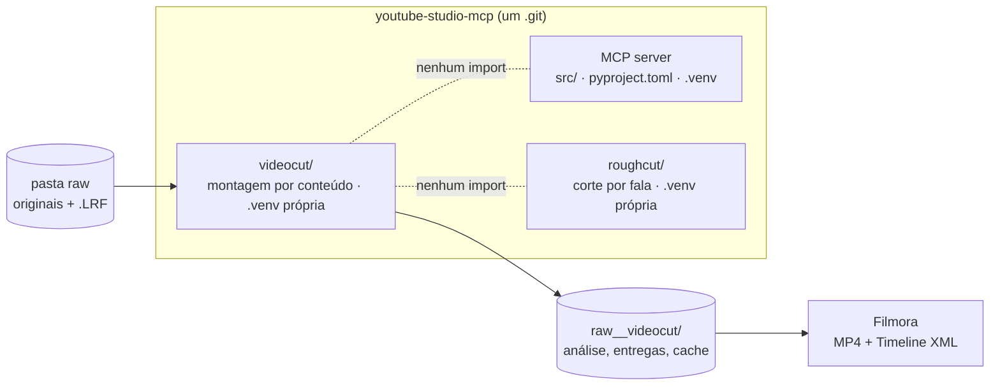
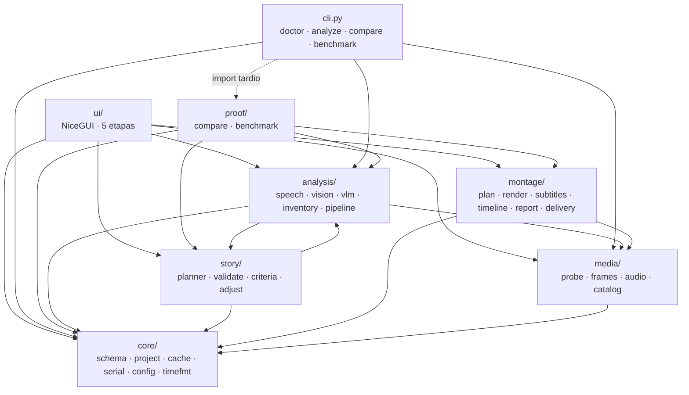
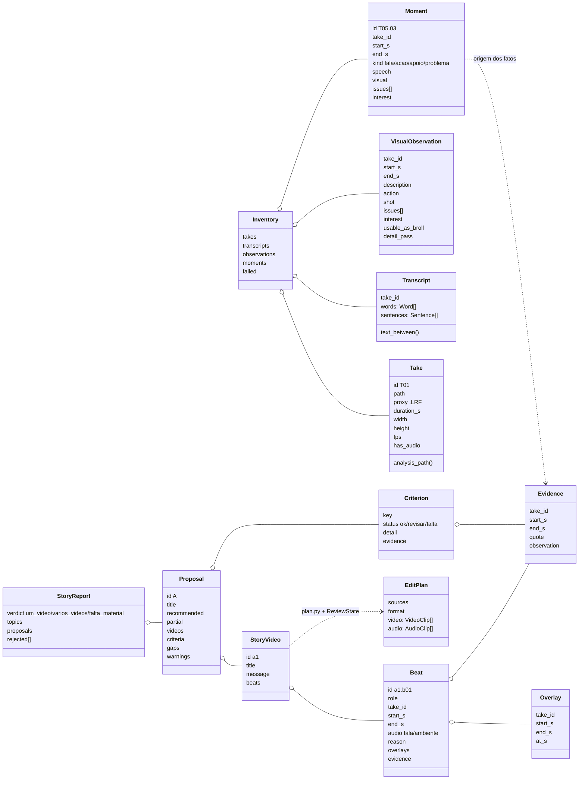
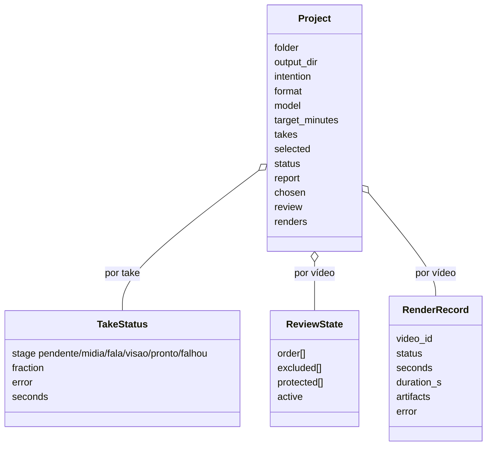
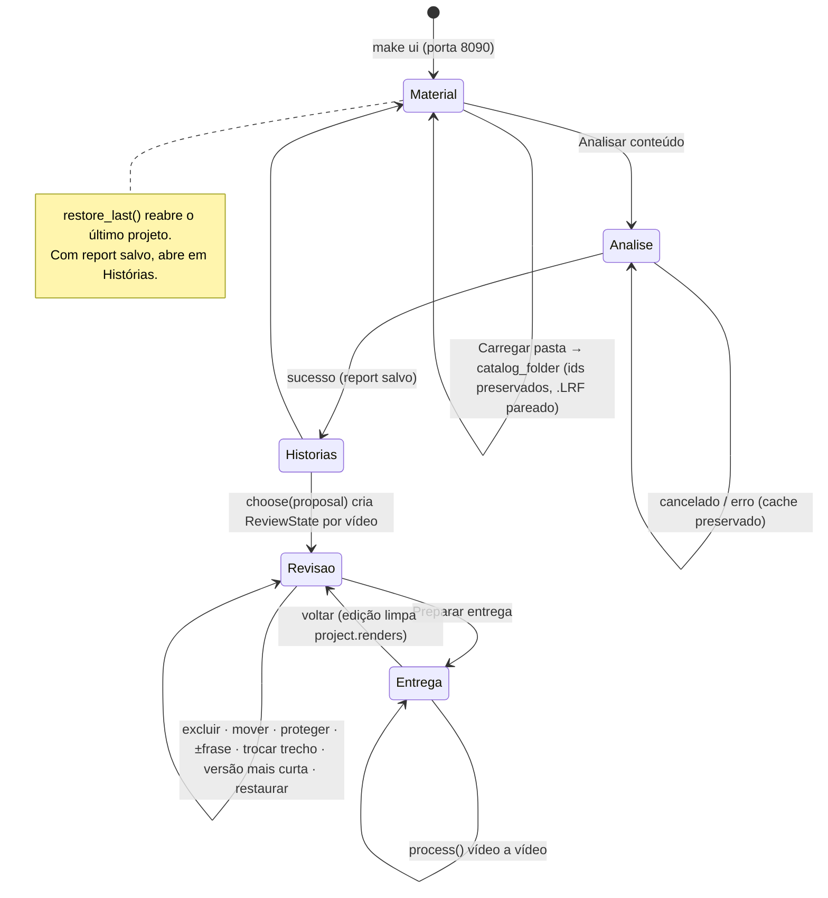
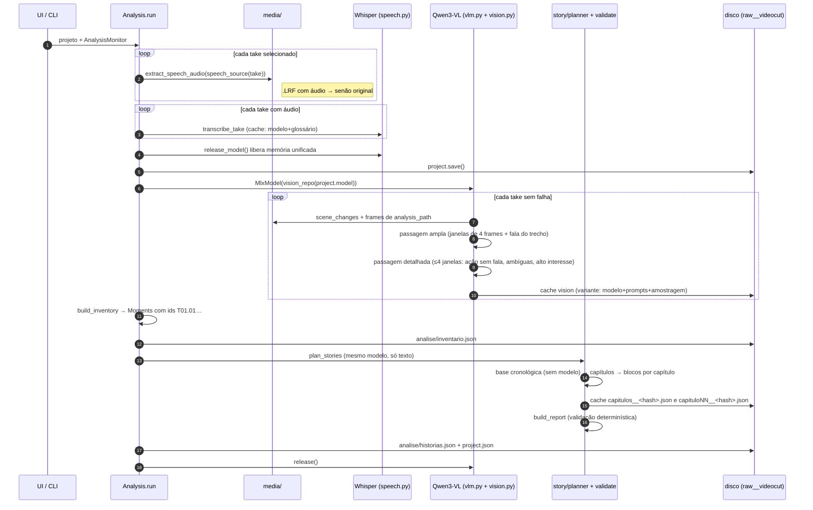
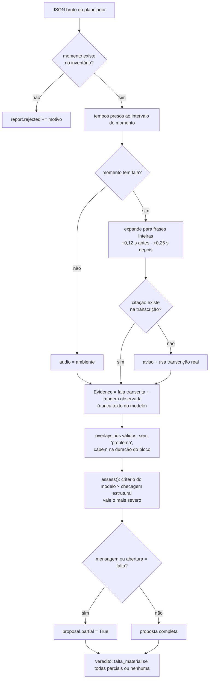
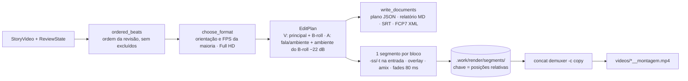

# Arquitetura do VideoCut

Referência para revisões futuras, feita para humanos e para agentes de IA. Os
diagramas são Mermaid: renderizam no GitHub e no VS Code, e o texto já é legível
sem renderização. Cada afirmação aponta para o arquivo que a implementa. Se o
código divergir deste documento, o código vale e este arquivo deve ser
atualizado junto com a mudança.

Estado descrito: branch `feat/videocut`, fases 1–11 de `PLANO.md`.

---

## 1. Lugar no monorepo



**Regra:** o `videocut/` não importa nada do MCP nem do Roughcut, e vice-versa. A
integração é só por arquivos. Execute tudo a partir de `videocut/`.

---

## 2. Pacotes e dependências

As arestas foram extraídas dos `import` reais (`grep '^from <pacote>'`).



| Pacote | Responsabilidade | Não pode |
|---|---|---|
| `core/` | Modelo de domínio (`schema.py`), estado persistido (`project.py`), proteção da origem (`safety.py`), cache por etapa, serialização de dataclasses, leitura de YAML | Importar qualquer outro pacote |
| `media/` | ffprobe (com rotação), miniaturas, frames, cenas, WAV de 16 kHz, proxy H.264, pareamento de `.LRF` | Chamar modelos |
| `analysis/` | Whisper (`speech.py`), modelo visual (`vlm.py`, `vision.py`), download protegido (`models.py`), inventário de momentos, orquestração (`pipeline.py`) | Decidir histórias |
| `story/` | Prompt editorial, validação determinística, critérios de suficiência, ajustes sem modelo | Ler mídia ou renderizar |
| `montage/` | Plano executável, render ffmpeg, SRT, FCP7 XML, relatório, pacote de entrega | Chamar modelos |
| `ui/` | Telas, estado da sessão, rota de mídia, player JS | Conter regra de negócio |
| `proof/` | Comparar com edição real e medir modelos | Ser usado pela UI |

**Acoplamento conhecido:** `analysis` ↔ `story` no nível de pacote. Entre
módulos não há ciclo: `analysis/pipeline.py → story/planner.py →
analysis/vlm.py`. Se crescer, mova `vlm.py` e `jsontext.py` para um pacote
`models/`.

---

## 3. Modelo de domínio

Fatos observados à esquerda; interpretação editorial à direita; execução embaixo.



Estado persistido em `core/project.py`:



---

## 4. Fluxo da aplicação (UI)



| Etapa | Arquivo | Ação principal | Execução |
|---|---|---|---|
| 1 Material | `ui/material.py` | `open_folder()`, seleção, intenção, formato, modelo, duração | `run.io_bound(catalog_folder)` |
| 2 Análise | `ui/analysis_view.py` | `start_analysis()` → `Analysis.run()` | thread; UI lê `AnalysisMonitor` a cada 0,5 s |
| 3 Histórias | `ui/stories.py` | veredito, propostas, critérios, evidência | síncrono |
| 4 Revisão | `ui/review.py` | edição do `ReviewState` e dos `Beat` | síncrono; prévia via `ui/player.js` |
| 5 Entrega | `ui/delivery_view.py` | `process()` → `montage.delivery.deliver()` por vídeo | `run.io_bound`, um vídeo por vez |

Moldura: `ui/shell.py` (`Shell.go`, `refresh`, `notify`, `on_live`, `activity`).
Toda ação que pode demorar roda dentro de `with shell.activity("…") as step:`
(`ui/activity.py`): cartão fixo com spinner, o que está sendo feito, detalhe do
passo, cronômetro e barra de progresso; ao terminar mostra "concluído em X s" ou
o erro. Enquanto ele roda, `shell.refuse_if_working()` bloqueia outra ação lenta. Chamadas
de UI feitas depois de um `await` passam por `shell.root`, porque o botão que
disparou a ação pode ter sido recriado.

---

## 5. Pipeline de análise (memória primeiro)

`analysis/pipeline.py` · `Analysis.run()`. Nunca há dois modelos pesados
carregados ao mesmo tempo.



Falha em um take resulta em `TakeStatus(falhou)` e o lote continua. Se nenhum
take sobrar, a análise inteira falha. O cancelamento é checado entre passos.

---

## 6. Do texto do modelo à proposta confiável

`story/validate.py` + `story/criteria.py`. É o ponto que impede a IA de
inventar uma história.



---

## 7. Render e entrega

`montage/plan.py → montage/render.py → montage/delivery.py`



Documentos são gravados antes do render: se o ffmpeg falhar, plano e timeline
continuam disponíveis. Encoder: `h264_videotoolbox` no Mac, `libx264` como
fallback. A timeline XML aponta sempre para os originais, nunca para os `.LRF`.

---

## 8. Arquivos em disco

```text
raw/                                  # protegida: nunca apagada, movida ou escrita (core/safety.py)
├── DJI_0001.MP4                      # render usa este
└── DJI_0001.LRF                      # prévia/análise usam este (Take.proxy)

raw__videocut/                        # core/project.py · Layout
├── project.json                      # Project inteiro (seleção, status, report, review, renders)
├── analise/
│   ├── inventario.json               # Inventory
│   ├── historias.json                # StoryReport original (base do "Restaurar original")
│   ├── capitulos__<hash>.json        # respostas do planejador por etapa (cache)
│   ├── capituloNN__<hash>.json
│   ├── comparacao__<video>.md        # make compare
│   └── benchmark.md / .json          # make benchmark
├── entregas/proposta-<id>__<video>/
│   ├── videos/  plans/  reports/  subtitles/  timelines/
├── .cache/<hash do arquivo>/         # transcript__*, vision__*, scenes
└── .work/                            # thumbs, frames, audio, proxies, render/segments

videocut/.state/ultimo.json           # último projeto aberto na UI (gitignored)
```

Chave de cache: caminho + tamanho + mtime do original (`core/cache.py`). As
variantes incluem modelo, prompt e parâmetros; trocar qualquer um invalida só
a etapa afetada.

---

## 9. Configuração editável

| Arquivo | Afeta | Invalida |
|---|---|---|
| `config/modelos.yaml` | repos Whisper/Qwen3-VL, amostragem de frames | cache de visão |
| `config/canal.yaml` | regras editoriais e formatos | cache do planejador |
| `config/glossario.yaml` | prompt inicial e correções do Whisper | cache de transcrição |
| `prompts/visao_ampla.md`, `visao_detalhe.md` | descrição visual | cache de visão |
| `prompts/capitulos.md`, `prompts/capitulo.md` | planejamento editorial em etapas | cache do planejador |

---

## 10. Invariantes para verificação

Use esta lista em revisões de código ou por agentes. Entre parênteses, onde a
suíte cobre cada item (`make test`, sem baixar modelos).

1. Nenhum arquivo da pasta de origem é apagado, movido, renomeado ou sobrescrito, e nada novo é gravado nela. Toda escrita passa por `core/safety.py::ensure_writable`. (`tests/test_safety.py`, incluindo `test_full_analysis_and_delivery_leave_the_source_folder_identical`, que compara o SHA-256 de cada arquivo antes e depois)
2. `videocut/` não importa do MCP nem do Roughcut. (`grep -rlE "roughcut|youtube_studio_mcp" videocut --include="*.py" --exclude-dir=.venv` deve voltar vazio)
3. Toda `Evidence` exibida vem de `Transcript`/`Moment`, nunca do texto do modelo. (`tests/test_story.py::test_invented_moments_and_quotes_never_reach_the_person`)
4. Ids inexistentes citados pelo planejador vão para `report.rejected`. (idem)
5. Critério estrutural `revisar/falta` não pode ser elevado a `ok` pelo modelo. (`test_model_cannot_upgrade_a_structurally_missing_criterion`)
6. Sem fala que sustente a mensagem, a proposta é parcial e o veredito é `falta_material`. (`test_missing_speech_makes_proposal_partial_and_verdict_insufficient`)
7. Cortes de fala caem em limites de frase. (`test_complete_story_is_anchored_to_facts`, `test_extend_trim_and_replace_keep_whole_sentences`)
8. Whisper é liberado antes de carregar o modelo visual. (`Analysis.transcribe` → `finally: release_model()`)
9. Falha de um take ou vídeo não interrompe o lote. (`test_failed_take_does_not_stop_the_batch`, `test_delivery_renders_each_video_and_isolates_failures`)
10. Reordenar blocos reaproveita segmentos renderizados. (`test_render_produces_final_video_with_expected_duration`)
11. Render e timeline usam `Take.path`; análise e prévia usam `Take.analysis_path`. (`test_vision_reads_frames_from_camera_proxy`, `test_speech_prefers_camera_proxy_with_audio`)
12. Blocos protegidos nunca saem na versão mais curta. (`test_shorten_never_removes_protected_beats`)
13. Qualquer edição na revisão invalida `project.renders`. (`ui/review.py::save`)
14. A interface e a CLI rodam offline: `enable_offline()` antes de qualquer import de `huggingface_hub`; só o downloader liga a rede. (verificado com proxy inexistente; ver `PLANO.md`)
15. Download de modelo nunca trava a análise: sem bytes por 90 s, o subprocesso é encerrado e retomado; após 5 tentativas, erro claro. (`tests/test_models.py`)
16. Toda ação demorada da UI tem feedback visual (o que faz, tempo, loader). (`tests/test_activity.py`)
17. Com o modo de cargas longas ligado, nenhuma chamada ao modelo nem bloco de render começa com o Mac acima do limite; a retomada exige ficar abaixo do limite de volta (histerese). (`tests/test_thermal.py`, `test_render_produces_final_video_with_expected_duration`)
18. Enquanto análise ou render rodam, o Mac não dorme (`caffeinate -i -m -s -w <pid>`), e o bloqueio termina junto com o trabalho, inclusive em erro. Nenhum ajuste do macOS é alterado. (`tests/test_power.py`)
19. Takes novos mais curtos que `material.min_take_s` chegam desmarcados; escolhas salvas nunca são sobrescritas. (`test_merge_takes_deselects_only_new_short_takes`)
20. O progresso da análise é salvo após cada take descrito: uma interrupção nunca apaga o que já foi feito. (`analysis/pipeline.py::Analysis.describe`)
21. Antes de analisar, se a memória livre não comporta o modelo escolhido (ou há swap alto/pressão), o app mostra quem ocupa memória e pede confirmação; nunca encerra apps sozinho. (`tests/test_memory.py`)
22. Fala útil que o modelo não escolheu nem descartou explicitamente volta para a montagem; nenhuma resposta curta do modelo encolhe o vídeo sozinha. (`tests/test_planner.py::test_omitted_speech_comes_back_and_explicit_discards_are_respected`)
23. Se o planejador falhar, a base cronológica vira a proposta. (`test_model_failure_falls_back_to_the_chronological_base`)
24. “Refazer histórias” nunca refaz Whisper nem visão: parte de `analise/inventario.json`. (`Analysis.replan`, `tests/test_planner.py`)

## 11. Pontos em aberto

- Importação do FCP7 XML no Filmora ainda não foi testada em uma instalação real.
- Qualidade do Qwen3-VL no material do canal ainda não foi medida (`make benchmark`).
- Concordância com a edição humana ainda não foi medida (`make compare`).
- Crossfade de áudio entre blocos é só fade in/out (80 ms), sem sobreposição.
- A prévia no navegador é aproximada; o MP4 renderizado é a referência.
